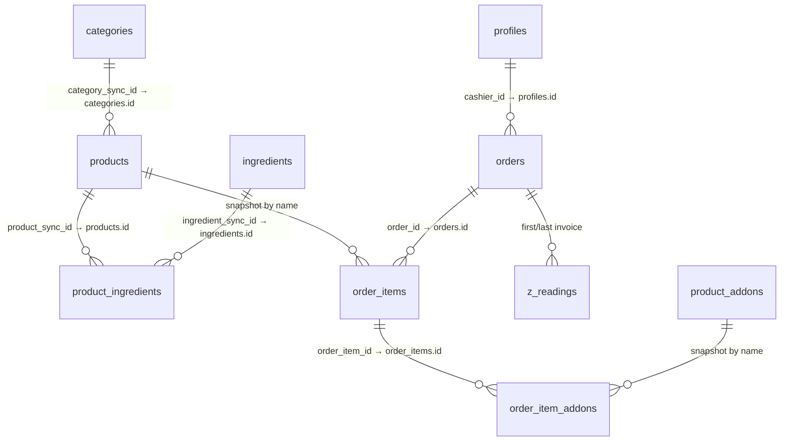

# Mire Sunset Database 🌅☕

Isar = fast on-device database (works offline) at `lib/core/database/isar_service.dart:18`. Supabase Postgres = central cloud copy at `lib/core/services/supabase_service.dart:5`. Both hold the same tables; the cloud is the single source of truth for sync.

For full RLS SQL and `.env` setup see `SETUP_GUIDE.md:59` and handover `README.md`.

---

## Overview: Local vs Cloud

| Layer | Where | What it holds |
|-------|-------|---------------|
| **Isar (Local)** | On each device (Windows `Documents/default.isar`, Android internal) | All tables below + extra `syncId` UUID to link to cloud. Works with no internet. |
| **Supabase Postgres (Cloud)** | Your Supabase project (owned by you) | Same tables. Central copy that merges all devices. |

**Key idea:** Every catalog row gets two IDs — local `Id int` (Isar `autoIncrement` at `lib/core/database/collections/category_entity.dart:6`) for speed on device, and cloud `id uuid` (`syncId`) generated via `uuid` at `lib/features/sync/catalog_sync_repository.dart:20`. Products link to categories by `category_sync_id` (cloud UUID), not the local int, so the link works on any device.

---

## Tables at a Glance

| Table | Purpose | Key link |
|-------|---------|----------|
| `profiles` | Staff accounts + single-session | `id` → Supabase Auth user |
| `categories` | Product groups (Coffee/Tea/Pastries) | `id` is PK |
| `products` | Menu items (Latte/Americano) | `category_sync_id` → `categories.id` |
| `product_addons` | Global add-ons (Oat Milk/Vanilla) | Standalone |
| `ingredients` | Stock items (Beans/Milk) | Standalone |
| `product_ingredients` | Recipe: which ingredient per product | `product_sync_id` → `products.id`, `ingredient_sync_id` → `ingredients.id` |
| `orders` | Sale header | `cashier_id` → `profiles.id` |
| `order_items` | Line per product in an order | `order_id` → `orders.id` |
| `order_item_addons` | Add-ons per line | `order_item_id` → `order_items.id` |
| `z_readings` / `running_totals` | BIR daily close | `first_invoice_id`/`last_invoice_id` → `orders.id` |

---

## Table Details (Simplified)

Types are shown as **SQL Type — Role**.

### `profiles`
| Column | Type | Notes |
|--------|------|-------|
| `id` | `uuid` — **Primary Key** (= Supabase Auth `auth.uid()`) | Links `UserEntity.supabaseUserId` at `lib/core/database/collections/user_entity.dart:18` |
| `username` | `text` | Stores email for cloud users; `@Index(unique:true)` locally |
| `name` | `text` | Display name |
| `password_hash` | `text` | Local cache only (Isar) |
| `role` | `text` | `admin` / `owner` / `cashier` (`lib/features/auth/auth_provider.dart:61`) |
| `active_session_id` | `text` — nullable | Single-session token, 15s watcher at `lib/features/auth/session_watcher.dart:33` via `app_navigator.dart` |

### `categories`
| Column | Type | Notes |
|--------|------|-------|
| `id` | `uuid` — **Primary Key** (= `syncId`, `@Index(unique:true)` at `category_entity.dart:6`) | Client-generated |
| `name` | `text` — **Unique** | `Coffee`, unique at DB + Isar |
| `is_active` | `boolean` | `isActive` locally |
| `updated_at` | `timestamptz` — nullable | `updatedAt` for sync ordering |
| `is_deleted` | `boolean` | Soft-delete; filtered in `lib/features/products/product_provider.dart` |

### `products`
| Column | Type | Notes |
|--------|------|-------|
| `id` | `uuid` — **Primary Key** (= `syncId`) | `@Index(unique:true)` at `product_entity.dart:6` |
| `name` | `text` — Indexed | `Latte` (`@Index(type: value)`) |
| `price` | `double precision` | `price` |
| `category_sync_id` | `uuid` — **Foreign Key → `categories.id`** — nullable | `categorySyncId` resolves local `categoryId` on pull |
| `is_active` | `boolean` | `isActive` |
| `updated_at` | `timestamptz` — nullable |  |
| `is_deleted` | `boolean` |  |

### `product_addons`
| Column | Type | Notes |
|--------|------|-------|
| `id` | `uuid` — **Primary Key** | `@Index(unique:true)` |
| `name` | `text` | `Oat Milk` |
| `price` | `double precision` |  |
| `is_per_unit` | `boolean` | `isPerUnit` (per pump vs flat) |
| `is_active` | `boolean` |  |
| `updated_at` | `timestamptz` |  |
| `is_deleted` | `boolean` | Filtered in `lib/features/products/addon_provider.dart` |

### `ingredients`
| Column | Type | Notes |
|--------|------|-------|
| `id` | `uuid` — **Primary Key** | `@Index(unique:true)` |
| `name` | `text` | `Coffee Beans` |
| `stock_quantity` | `double precision` | Local stock only — **not overwritten on pull** at `catalog_sync_repository.dart:256` |
| `unit` | `text` | `grams`/`ml` |
| `updated_at` | `timestamptz` |  |
| `is_deleted` | `boolean` | Filtered in `lib/features/inventory/inventory_screen.dart` |

### `product_ingredients` (Recipe)
| Column | Type | Notes |
|--------|------|-------|
| `id` | `uuid` — **Primary Key** | `@Index(unique:true)` |
| `product_sync_id` | `uuid` — **Foreign Key → `products.id`** | `productSyncId` resolves local `productId` |
| `ingredient_sync_id` | `uuid` — **Foreign Key → `ingredients.id`** | `ingredientSyncId` resolves `ingredientId` |
| `amount_used` | `double precision` | e.g. `18` grams per Latte |
| `updated_at` | `timestamptz` |  |
| `is_deleted` | `boolean` |  |

### `orders`
| Column | Type | Notes |
|--------|------|-------|
| `id` | `bigint` — **Primary Key** via `get_next_invoice_id()` (BIR sequence) | Local `OrderEntity.id` at `lib/core/database/collections/order_entity.dart:7` `Isar.autoIncrement` is overwritten with this global id |
| `subtotal` / `discount_amount` / `total` | `double precision` |  |
| `vatable_sales` / `vat_amount` / `exempt_sales` | `double precision` |  |
| `payment_method` | `text` | `cash` / `gcash` / `card` (manual ref) |
| `amount_received` / `change_due` | `double precision` |  |
| `reference_number` | `text` — nullable | Auto GCash ref |
| `created_at` | `timestamptz` — **Indexed** | `createdAt` |
| `cashier_id` | `text` — **Foreign Key → `profiles.id`** | `cashierId` (`String` storing UUID) |
| `is_voided` / `void_reason` | `boolean` / `text` |  |
| `is_synced` | `boolean` — **Indexed** | Local Isar only (`isSynced` at `order_entity.dart:28`) — not in cloud |

### `order_items`
| Column | Type | Notes |
|--------|------|-------|
| `id` | `bigint` — **Primary Key** |  |
| `order_id` | `bigint` — **Foreign Key → `orders.id`** |  |
| `product_name` | `text` | Snapshot at sale time |
| `base_price` / `subtotal` | `double precision` |  |
| `quantity` | `integer` |  |

### `order_item_addons`
| Column | Type | Notes |
|--------|------|-------|
| `id` | `bigint` — **Primary Key** |  |
| `order_item_id` | `bigint` — **Foreign Key → `order_items.id`** |  |
| `addon_name` | `text` | Snapshot |
| `price` / `subtotal` | `double precision` |  |
| `quantity` | `integer` | Per-unit pumps |

### `z_readings` (+ `running_totals`)
| Column | Type | Notes |
|--------|------|-------|
| `id` | `bigint` — **Primary Key** | `ZReadingEntity` at `lib/core/database/collections/z_reading_entity.dart:7` |
| `reading_date` | `timestamptz` — **Indexed** | `readingDate` |
| `reset_counter` | `integer` | BIR counter |
| `gross_sales` / `net_sales` / `vat_amount` / `total_discounts` | `double precision` |  |
| `first_invoice_id` / `last_invoice_id` | `bigint` — **FK → `orders.id`** |  |
| `total_transaction_count` | `integer` |  |
| `is_synced` | `boolean` — **Indexed** | Local only |

---

## How Sync Fields Work

*   **`syncId` (uuid):** Generated on the device that creates the row (`uuid: ^4.6.0` at `pubspec.yaml:57`). It becomes the cloud `id` and never changes. Pulls match by `syncId` first, then by `name` to merge locally-seeded duplicates (`lib/features/sync/catalog_sync_repository.dart:205`).
*   **`updated_at`:** Set on every push; pull overwrites older local rows (last-write-wins).
*   **`is_deleted`:** Soft-delete — Admin delete sets `is_deleted=true` on cloud and `isDeleted=true` locally; filtered out in providers (`product_provider.dart`, `addon_provider.dart`, `inventory_screen.dart`) instead of hard-deleting.
*   **`category_sync_id` / `product_sync_id` / `ingredient_sync_id`:** Cloud FKs using `syncId`s. On pull, the code builds `catSyncToLocal`/`ingSyncToLocal`/`prodSyncToLocal` maps (`catalog_sync_repository.dart:200`) to translate cloud UUID → local int `categoryId`/`productId`/`ingredientId`.

---

## Entity-Relationship (Mermaid)

---

## Security Summary

*   `is_admin_or_owner()` at `SETUP_GUIDE.md` — `SECURITY DEFINER`, reads `profiles` where `id = auth.uid() and role in ('admin','owner')`.
*   **RLS:** `SELECT to authenticated using (true)` on all catalog + order tables (all logged-in can read). `ALL to authenticated using/with check (is_admin_or_owner())` on catalog tables (only Admin/Owner can write). `profiles` self + admin.
*   **BIR:** `get_next_invoice_id()` sequence + triggers block `UPDATE/DELETE` of finalized invoices (see `SETUP_GUIDE.md:59`).

---

See also: `FLOWS.md` for step-by-step sync and login flows, `README.md` for client handover, `SETUP_GUIDE.md` for full RLS SQL.
