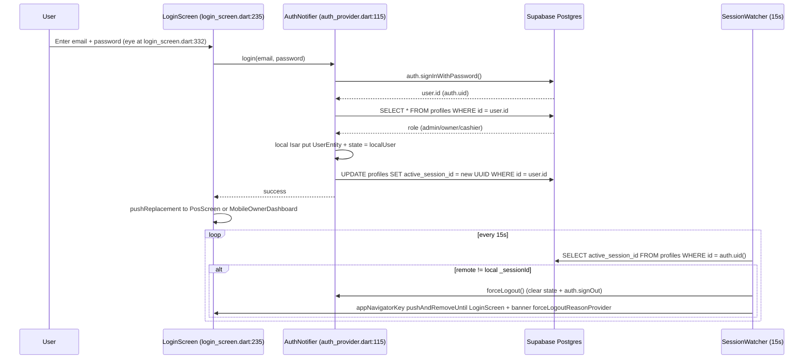
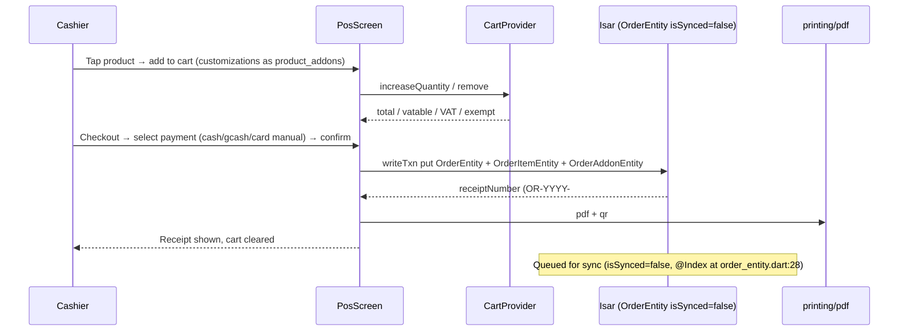
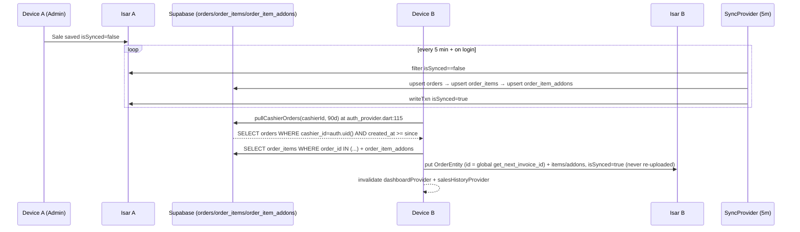
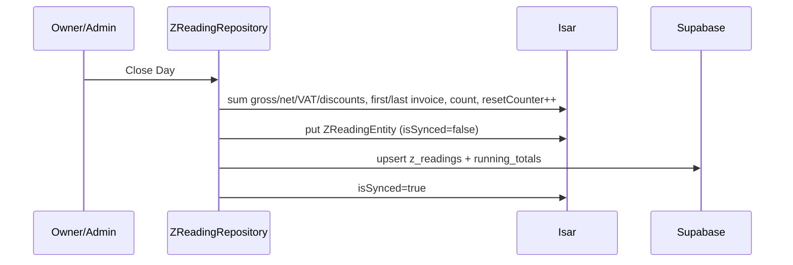
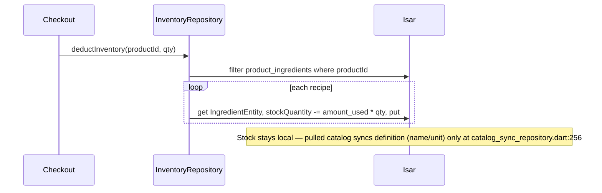

# Mire Sunset Flows 🌅☕

> Step-by-step flows for the offline-first POS. See `DATABASE.md` for tables and `SETUP_GUIDE.md:59` for RLS/SQL.

All diagrams are Mermaid (rendered on GitHub).

---

## 1) Login + Single Session per Account

15s watcher at `lib/features/auth/session_watcher.dart:33` via `app_navigator.dart` + `profiles.active_session_id`.



Offline path: `auth_provider.dart:115` falls back to `_tryOfflineLogin` → Isar `UserEntity` compare `passwordHash`; still triggers `catalogSyncProvider` pull when back online.

---

## 2) Sale — Offline-First (Cash / GCash / Card manual)

Core cart at `lib/features/cart/`, checkout at `lib/features/checkout/`, Isar `OrderEntity` at `lib/core/database/collections/order_entity.dart:6`.



---

## 3) Order Sync — Cross-Device (5 min + on login)

`SyncRepository.syncPendingOrders()` at `lib/features/sync/sync_repository.dart:13`, `SyncProvider` 5 min timer at `lib/features/sync/sync_provider.dart`, pull at `sync_repository.dart:136`.



BIR note: `get_next_invoice_id()` sequence + triggers block `UPDATE` of finalized invoices (see `SETUP_GUIDE.md:59`).

---

## 4) Catalog Sync — Shared Menu (30s, full including ingredients)

`CatalogSyncRepository` at `lib/features/sync/catalog_sync_repository.dart:13` (uuid `syncId`), `CatalogSyncProvider` 30s at `lib/main.dart` + `lib/features/sync/catalog_sync_provider.dart`, name-merge at `catalog_sync_repository.dart:205`.

```mermaid
sequenceDiagram
    participant Adm as Admin Device
    participant PR as ProductRepository (product_repository.dart:41)
    participant CR as CatalogSyncRepository
    participant SB as Supabase (categories/products/product_addons/ingredients/product_ingredients)
    participant Oth as Other Device
    participant CP as CatalogSyncProvider (30s)

    Adm->>PR: saveProduct(name, price, categoryId)
    PR->>CR: upsertCategory(category) first (ensure syncId)
    PR->>PR: product.categorySyncId = category.syncId
    CR->>SB: upsert categories/products/... (id = syncId, soft-delete = false)
    PR->>PR: Isar put (now with syncId)
    loop every 30s + on login
        Oth->>CP: pullCatalog()
        CP->>SB: SELECT * FROM 5 catalog tables
        CP->>CP: categories → ingredients → products (resolve categorySyncId→localId via catSyncToLocal) → addons → product_ingredients (resolve via prod/ing maps)
        Note over CP: If syncId miss, merge by name (e.g. seeded "Coffee"); if cloud is_deleted and no local → skip (avoids LateInitializationError)
        CP->>CP: invalidate productProvider + categoriesProvider + addonProvider
    end
    Oth-->>Oth: POS grid shows new product
```

Soft-delete: `deleteProduct()` at `product_repository.dart:41` sets local `isDeleted=true` + `softDelete('products', syncId)` → cloud `is_deleted=true` → other devices mark local `isDeleted=true` and filter out at `lib/features/products/product_provider.dart` / `addon_provider.dart` / `inventory_screen.dart`.

---

## 5) Z-Reading / Reports (BIR Daily Close)

`lib/features/reports/z_reading_repository.dart` + `running_totals`, `ZReadingEntity` at `lib/core/database/collections/z_reading_entity.dart:7`.



---

## 6) Inventory Deduction (per sale)

`lib/features/inventory/inventory_repository.dart:7` — recipes `product_ingredients` define `amount_used` per `productId`.



---

See `DATABASE.md` for table schemas and `README.md` for client handover. For setup, follow `SETUP_GUIDE.md`.
